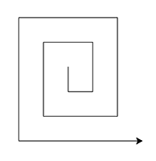
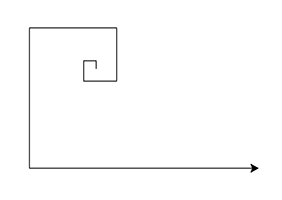
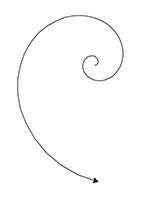
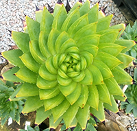
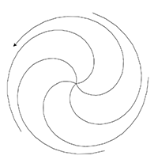
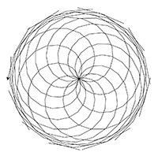

Requirements: Do at least exercise 1.

0. In the Terminal or Anaconda Prompt, type the following:

conda activate cs2526
conda install scipy

1. Make a rectangular spiral in `01_rectangular_spiral.py`

2. Make a rectangular *golden* spiral in `02_rectangular_golden_spiral.py`

3. Make a smoother version of a golden spiral in `03_smooth_golden_spiral.py`

4. 
The aloe polyphylla plant grows in a pattern with five golden(ish) spirals
eminating from the same center.

Make a function that draws a single golden spiral, and use that to draw a shape
like the aloe polyphylla in `04_aloe_polyphylla.py`

5. The pattern that pinecones (and sunflower seeds!) grow in can be described by
some number of clockwise spirals and a different number of counter-clockwise
spirals, where those two numnbers are sequential fibbonacci numbers.

Draw such a pattern with 8 counter-clockwise spirals and 13 clockwise spirals in
`05_pinecone.py`

